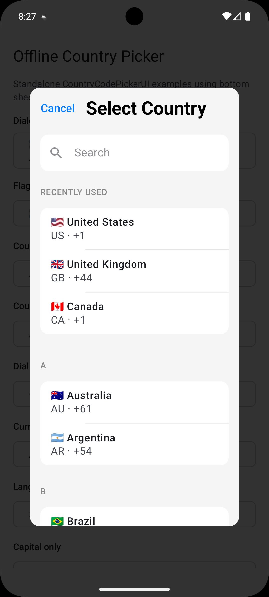
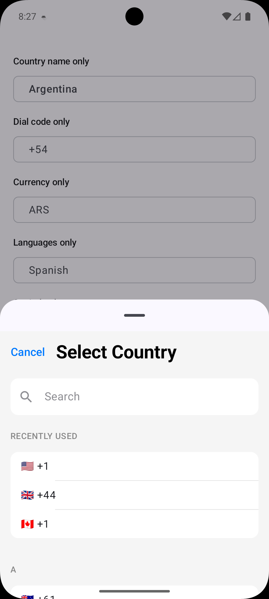
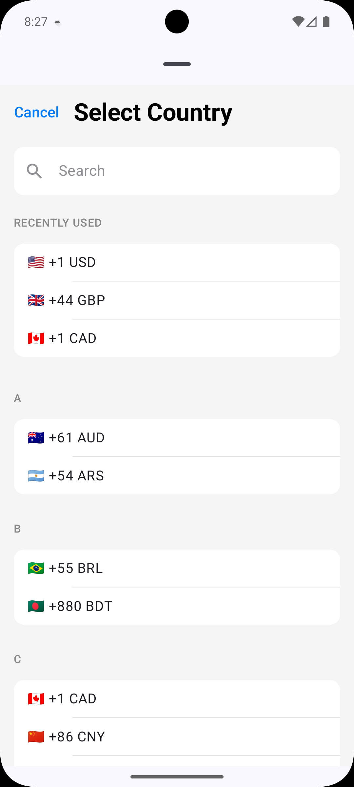
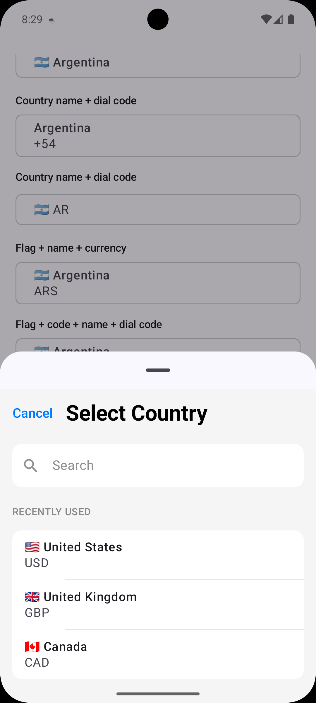
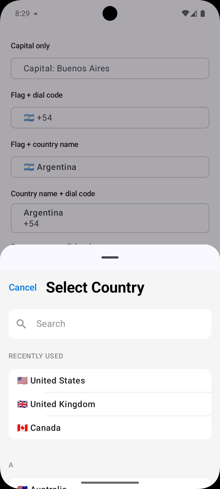

# Offline Country Picker

A Jetpack Compose country code or name, currency, phone code , languages,currency and capitals picker that works fully offline.

## Features

- Offline country list with flags, ISO country codes, dial codes, currencies, capitals, and languages.
- Compose UI for selecting countries in a modal bottom sheet or dialog.
- Configurable selected-country and picker-row display options.
- Sources and Javadocs are generated for Maven Central publication.

## UI Preview

| Dialog picker | Dial code rows | Currency rows | Flag + currency | Flag + name |
| --- | --- | --- | --- | --- |
|  |  |  |  |  |

## Installation

```kotlin
dependencies {
    implementation("io.github.valentinerutto:offline-country-picker:1.0.0")
}
```

## Usage

```kotlin
var selectedCountry by remember {
    mutableStateOf(CountryDataProvider.getCountryByCode("KE"))
}

CountryCodePickerUI(
    selectedCountry = selectedCountry,
    onCountrySelected = { selectedCountry = it },
    selectedCountryDisplayOptions = CountryDisplayDefaults.FlagAndDialCode,
    pickerItemDisplayOptions = CountryDisplayDefaults.FlagNameCodeAndDialCode
)
```

To show the picker as a dialog:

```kotlin
CountryCodePickerUI(
    selectedCountry = selectedCountry,
    onCountrySelected = { selectedCountry = it },
    pickerPresentation = CountryPickerPresentation.DIALOG
)
```

To show the picker as a modal bottomsheet:

```kotlin
CountryCodePickerUI(
    selectedCountry = selectedCountry,
    onCountrySelected = { selectedCountry = it },
    pickerPresentation = CountryPickerPresentation.MODAL_BOTTOM_SHEET
)
```

## Display Customization

Use `selectedCountryDisplayOptions` to control what appears in the closed picker button, and `pickerItemDisplayOptions` to control what appears in each country row inside the picker.

```kotlin
CountryCodePickerUI(
    selectedCountry = selectedCountry,
    onCountrySelected = { selectedCountry = it },
    selectedCountryDisplayOptions = CountryDisplayDefaults.FlagAndDialCode,
    pickerItemDisplayOptions = CountryDisplayDefaults.FlagNameCodeAndDialCode
)
```

Available presets:

```kotlin
CountryDisplayDefaults.Flag
CountryDisplayDefaults.Code
CountryDisplayDefaults.Name
CountryDisplayDefaults.DialCode
CountryDisplayDefaults.Currency
CountryDisplayDefaults.Languages
CountryDisplayDefaults.Capital
CountryDisplayDefaults.FlagAndDialCode
CountryDisplayDefaults.FlagAndName
CountryDisplayDefaults.NameAndDialCode
CountryDisplayDefaults.FlagNameAndCurrency
CountryDisplayDefaults.FlagNameCodeAndDialCode
CountryDisplayDefaults.NameAndCurrency
CountryDisplayDefaults.FlagDialCodeAndCurrency
```

You can also pass your own set:

```kotlin
CountryCodePickerUI(
    selectedCountry = selectedCountry,
    onCountrySelected = { selectedCountry = it },
    selectedCountryDisplayOptions = setOf(
        CountryDisplayOption.FLAG,
        CountryDisplayOption.NAME
    ),
    pickerItemDisplayOptions = setOf(
        CountryDisplayOption.FLAG,
        CountryDisplayOption.NAME,
        CountryDisplayOption.CODE,
        CountryDisplayOption.DIAL_CODE,
        CountryDisplayOption.CURRENCY
    )
)
```

## License

MIT. See [LICENSE](LICENSE).
